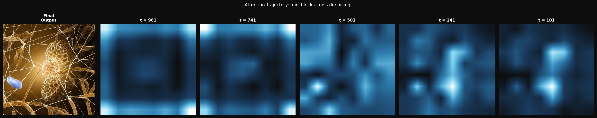
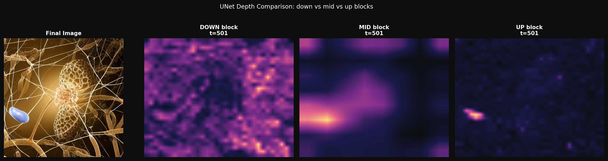
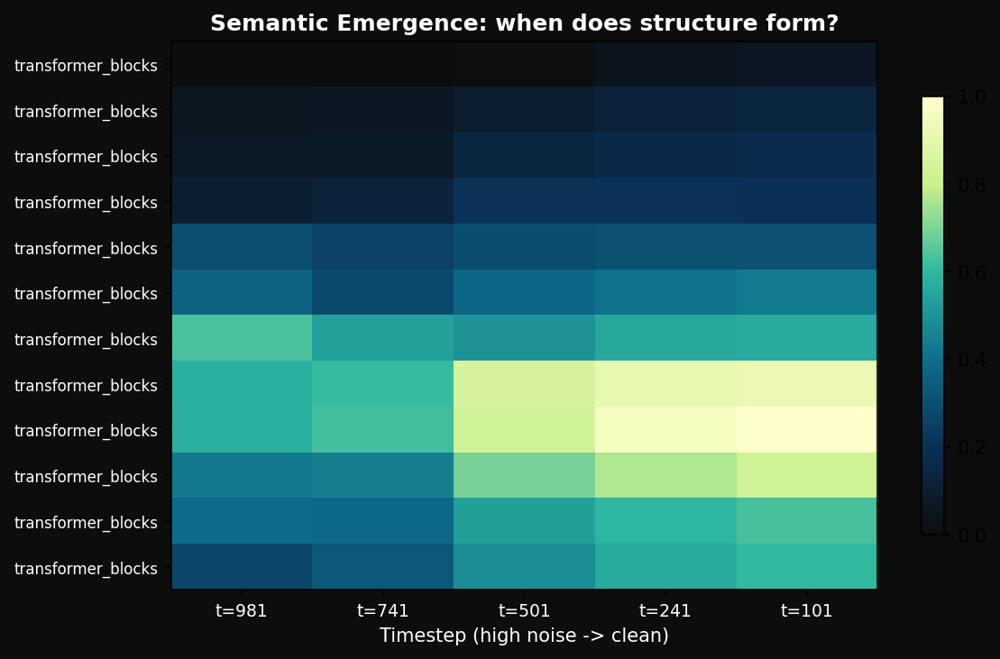
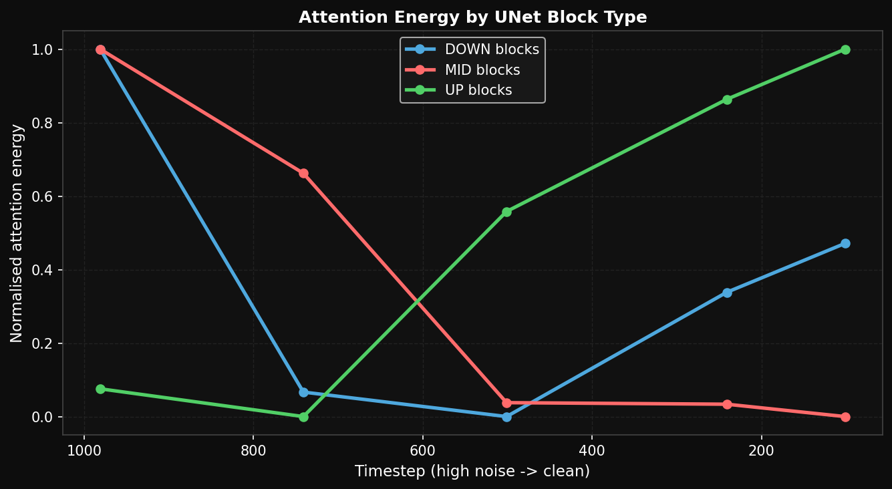
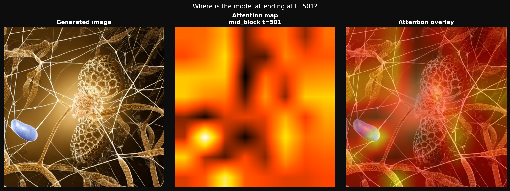

# diffusion-interpretability
Visualizing attention maps across the denoising trajectory of Stable Diffusion — a mechanistic interpretability study
# Diffusion Model Interpretability: What Does a Diffusion Model Attend To As It Denoises?

A mechanistic interpretability study of attention maps across the denoising 
trajectory of Stable Diffusion v1.5.

## Key finding

At timestep t=501 — halfway through denoising — the UNet mid-block already 
attends preferentially to semantic objects over background texture, before 
the final image exists. Semantic planning precedes pixel rendering by 
hundreds of denoising steps.

## Figures

### Figure 1 — Attention trajectory (mid block, t=951→101)

Attention evolves from diffuse (high noise) to structured (low noise).

### Figure 2 — UNet depth comparison at t=501

DOWN blocks encode coarse layout. MID block holds semantic structure. 
UP blocks reconstruct local texture.

### Figure 3 — Semantic emergence heatmap

Layer × timestep map showing when and where structure locks in.

### Figure 4 — Attention energy by block type

DOWN blocks decay faster than MID/UP — encoder layers commit to 
structure early, decoder layers refine until the end.

### Figure 5 — Attention overlay on generated image

Mid-block attention at t=501 concentrates on the blue organelle and 
central cellular structure, suppressing background filament texture.

## Why this matters for AI safety

If a model decides what to attend to this early in denoising, then 
Interventions at high timesteps could steer generation before structure 
locks in — directly relevant to controllability and interpretability 
of generative systems. This connects to Anthropic's mechanistic 
interpretability research agenda.

## Method

- Model: Stable Diffusion v1.5
- Framework: PyTorch + diffusers 0.38
- Hook type: Forward hooks on all UNet attention modules (32 total)
- Metric: L2 norm of attention output as activation energy proxy
- Timesteps captured: t=951, 751, 501, 251, 101

## Background

**Author:** IQRA NADEEM | BSc + MS Bioinformatics, MS thesis in Generative AI  
**Institution:** University of Agriculture, Faisalabad

## Run it yourself

Open in Colab:

## Limitations

- L2 norm of attention output is a proxy for attention weight — 
  future work should extract raw attention weight matrices directly
- Results shown on SD1.5; may differ on SDXL or newer architectures
- Spatial resolution limited by UNet downsampling
